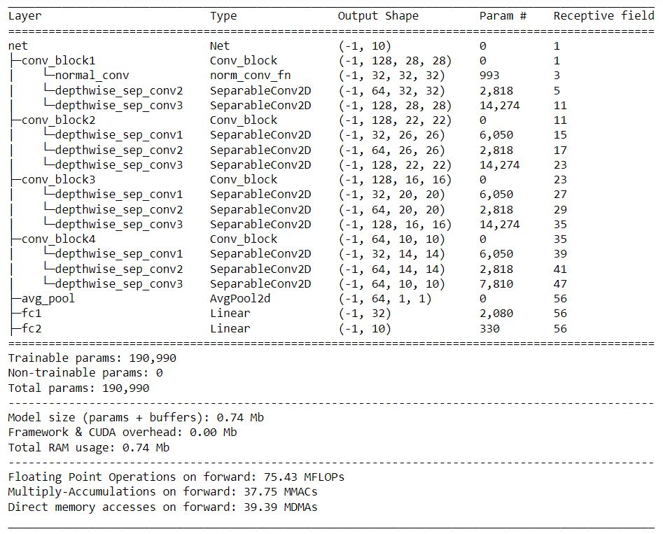
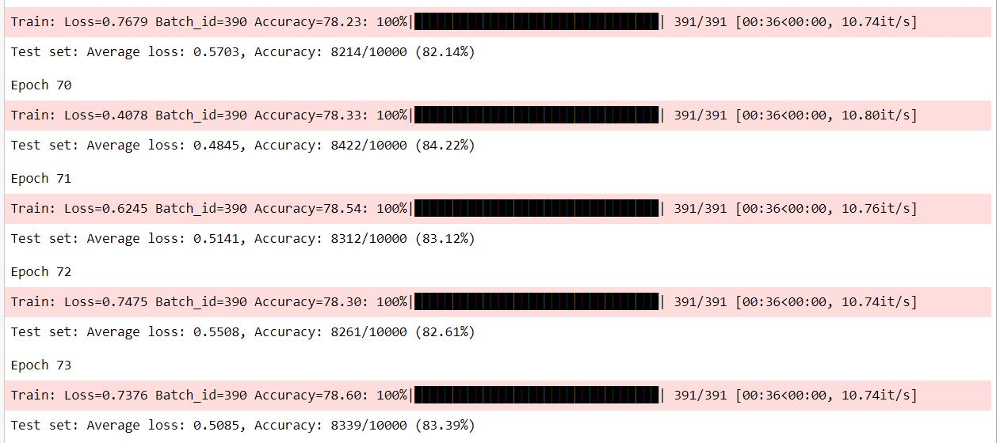

# Submission for Week 5

- [Problem Statement](#Problem-Statement)
- [File Structure](#File-Structure)
- [Applied Augmentation](#Applied-Augmentation)
- [Model Parameters](#Model-Parameters)
- [Receptive Field and Output Shape Calculation of Best Model](#Receptive-Field-and-Output-Shape-Calculation-of-Best-Model)
- [Training Logs](#Training-Logs)
- [Results](#Results)
  * [Accuracy](#Accuracy)
  * [Accuracy Plot](#Accuracy-Plot)
  * [Misclassified Images](#Misclassified-Images)
  * [Accuracy Report for Each class](#Accuracy-Report-for-Each-class)

# Problem Statement

### Training CNN for CIFAR Dataset

1. keep the parameter count less than 200,000
2. Use Dilated Convolution and depth-wise convolution
3. Get at least 85% accuracy

# File Structure

* src
  * Contains all the code required during training in different modules
    * model.py -> Contains the model architecture
    * uitls.py -> contains functions for training, testing, data loader, plotting and extra supportive functions for code
* S9.ipynb
  * contains the execution of code 

# Model Parameters

The Model Uses [***Dilated Convolution and Depthwise Separable Convolution***] 

    

 
# Training Logs

    

       

# Results

## Accuracy 

  Test Accuracy : 84.22%
  Train Accuracy : 78.33%

